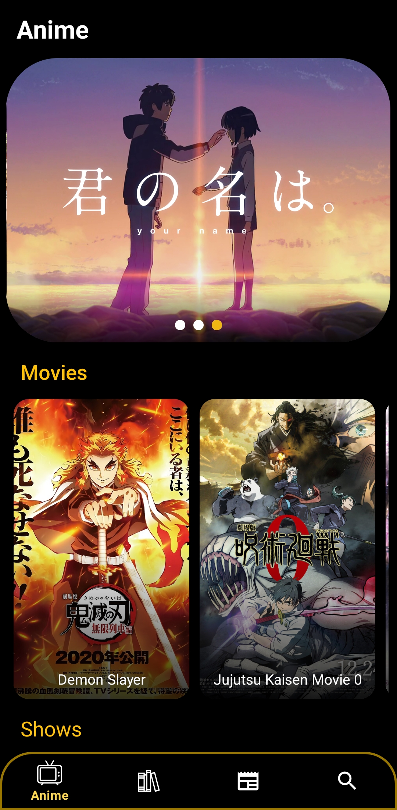
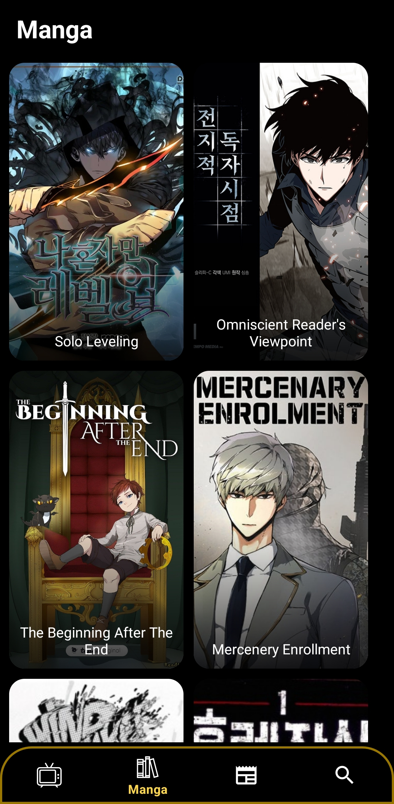

# AnimeVerse

                                    An Android app to watch anime on your phone without ads.
# Description
The AnimeVerse app is a feature-rich platform designed for Android Studio that caters to anime enthusiasts. With its comprehensive set of functionalities, the app allows users to stream anime, read comics, and stay updated with the latest news in the world of anime. It aims to provide a convenient and immersive experience for anime lovers, bringing together various aspects of the anime culture into one user-friendly application 

# Features:
    Search Anime, Comic
    Popular Animes
    Anime Movies
    Popular Manga,Manhwa
    Latest News And Updates

# Technologies used:
    Android Studio 
    Language: Java, XML
    Database: Firebase Realtime Database

# Screenshots

